# CS3611 Project 9 — 测试报告

**正式验证 Run ID：** `report_demo_01`  

---

## 1. 测试目的

验证系统满足课程要求，并在统一入口 `scripts/run_demo.sh` 下完成：

1. 正常/混合攻击流量生成与 tcpdump 抓包
2. PCAP → 特征 CSV → MLP 推理 → decision.json
3. iptables 防御联动（限速 + 自动封禁/loopback 限速）
4. 防御前后攻击成功率变化
5. 防御前后 CPU/内存负载变化


---

## 2. 测试环境

| 项目 | 配置 |
| ---- | ---- |
| 运行平台 | Ubuntu 虚拟机（Linux + iptables + tcpdump） |
| 受害目标 | `127.0.0.1:8080`（`demo_site/` 静态 HTTP） |
| Python | 3.8+，PyTorch，依赖见 `models/requirements.txt` |
| 普通 demo 命令 | `bash scripts/run_demo.sh --run-id report_demo_01` |
| 实时 demo 命令 | `bash scripts/run_realtime_demo.sh --run-id realtime_demo_01` |

---

## 3. 测试范围与结果总览

| 测试项 | 要求 | 结果 |
| ------ | ---- | ---- |
| 三组合同接口 | 代码可运行 | 通过 |
| 端到端 demo | 攻击→检测→防御→对比 | Run `report_demo_01` 通过 |
| 攻击效果前后变化（pcap/CSV） | 测试报告截图 | 见 §5，Wireshark 图 4～9；仪表盘 图 11 |
| CPU/内存负载前后变化 | 测试报告截图 | 见 §6，图 2、3 |
| PPS / 模型 / 防御日志 | 辅助证据 | 见 §5、§7～§8 |
| 实时攻防联动 | 攻击进行中在线封禁 | Run `realtime_demo_01` 通过，见 §9 |
| Redis 双写 | 特征/决策/封禁可查 | 见 §10，图 14、15 |
| 扩展功能 | 无监督、CDN 等 | 见 §11 |

---

## 4. 测试方法说明

### 4.1 普通完整 demo

```bash
bash scripts/run_demo.sh --check-only
bash scripts/run_demo.sh --run-id report_demo_01
```

产出 Run ID `report_demo_01`，含 PCAP、CSV、`decision_report_demo_01.json`、`defense_blocks.log` 等。图 2～11 均来自该次演示验证记录。

### 4.2 实时攻防 demo

```bash
bash scripts/run_realtime_demo.sh --run-id realtime_demo_01
.venv/bin/python scripts/visualize_realtime_demo.py --run-id realtime_demo_01
```

---

## 5. 防御前后攻击效果变化

### 5.1 测试定义

- **对比方式**：同一 `run_demo.sh` 流程，防御前 / 后各运行同参数混合攻击（SYN+HTTP+UDP，20 s）
- **防御启用**：特征提取 → MLP 推理 → `iptables_rules.sh` → `apply_decision.py`
- **指标 A（主）**：Wireshark / CSV 的 PPS、包数（攻击流量抵达 lo/127.0.0.1 的规模）
- **指标 B（辅）**：`http_flood.log` 中 HTTP `status_code=200` 比例

### 5.2 Wireshark 抓包对比（pcap）

数据来源：`data/pcap/report_demo_01/`，Wireshark → 统计 → 捕获文件属性。

| 场景 | pcap 文件 | 包数 | 时长(s) | 平均 PPS |
| ---- | --------- | ---- | ------- | -------- |
| 正常流量 | `normal_report_demo_01.pcap` | 588 | 9.98 | 58.9 |
| 攻击（防御前） | `attack_before_defense_report_demo_01.pcap` | 29,300 | 24.23 | 1209.1 |
| 攻击（防御后） | `attack_after_defense_report_demo_01.pcap` | 3,450 | 22.68 | 152.2 |

变化（防御前 → 防御后）：

| 指标 | 防御前 | 防御后 | 降幅 |
| ---- | ------ | ------ | ---- |
| 总包数 | 29,300 | 3,450 | ↓ 88.2% |
| 平均 PPS | 1209.1 | 152.2 | ↓ 87.4% |

### 5.3 特征 CSV 峰值 PPS（与 pcap 互证）

数据来源：`data/features/report_demo_01/*.csv`

| 场景 | 平均 PPS | 峰值 PPS |
| ---- | ------ | ------ |
| 正常流量 | 53.5 | 60 |
| 攻击（防御前） | 18.6* | 1475 |
| 攻击（防御后） | 2.2* | 411 |

\* 含起止过渡窗口；峰值 PPS 降 72.1%（1475→411）。Wireshark I/O 图攻击高峰约 **1.7k pps**（防御前）、稳态约 **130 pps**（防御后），与 CSV 峰值趋势一致。

### 5.4 HTTP 攻击日志（防御后，单侧）

数据来源：`data/logs/report_demo_01/http_flood.log`
| 指标 | 数值 |
| ---- | ---- |
| 总 HTTP 请求 | 274 |
| 成功 (200) | 95 |
| 失败 | 179 |
| 成功率 | 34.7% |


### 5.5 模型推理结果（decision.json）

**文件：** `data/logs/report_demo_01/decision_report_demo_01.json`

| 指标 | 数值 |
| ---- | ---- |
| 决策总数 | 1470 |
| 攻击判定 | 1470（100%） |
| 攻击类型 | mixed_attack |
| 置信度范围 | 0.835 ~ 1.000 |
| 平均置信度 | 0.985 |

### 5.6 结论

开启完整智能防御后，同等混合攻击下抵达受害者的流量规模显著下降（包数约降 88%，平均 PPS 约降 87%，CSV 峰值 PPS 约降 72%），HTTP 成功率降至 34.7%，与 MLP 输出 1470 条攻击判定及 `defense_blocks.log` 联动记录一致。

### 5.7 截图（Wireshark）

**图 4：** Wireshark 属性 · 正常（588 包，58.9 pps）

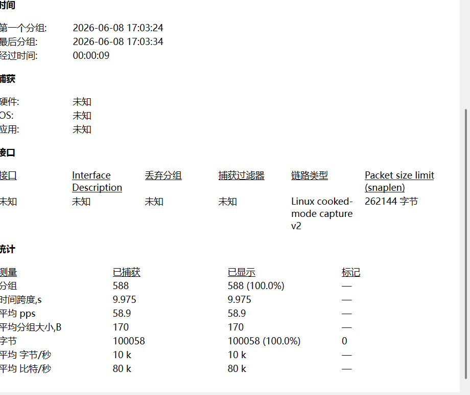

**图 5：** Wireshark 属性 · 防御前（29300 包，1209.1 pps）

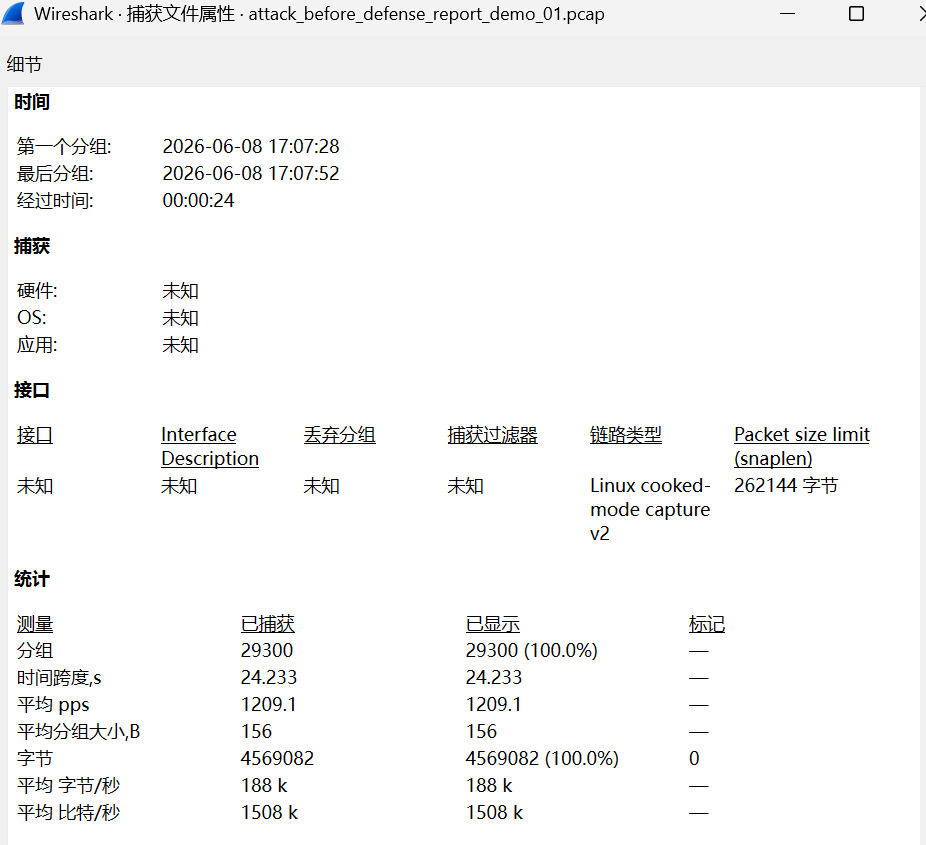

**图 6：** Wireshark 属性 · 防御后（3450 包，152.2 pps）

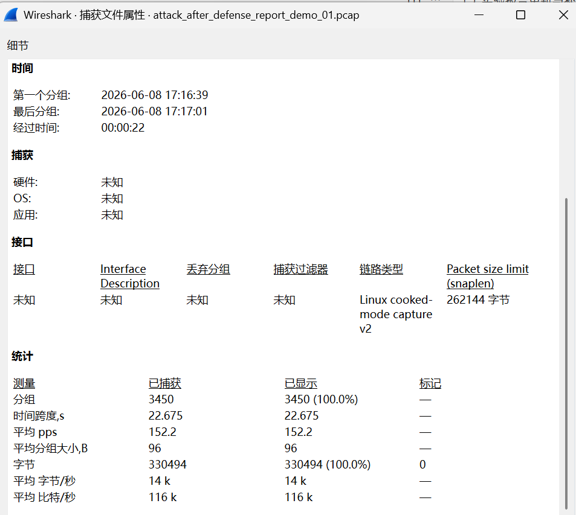

**图 7：** Wireshark I/O · 正常（~60 pps）

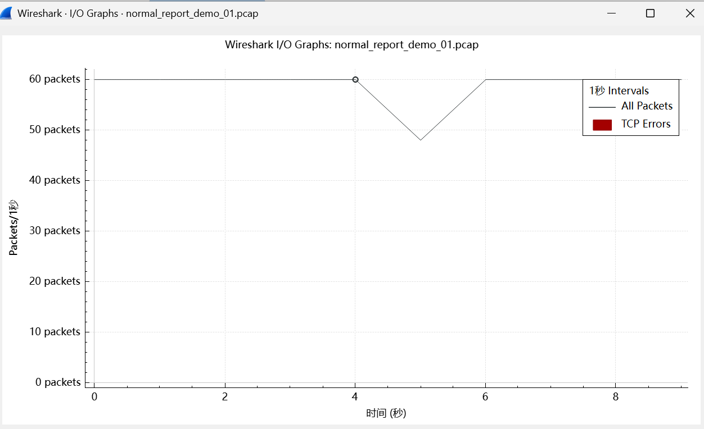

**图 8：** Wireshark I/O · 防御前（峰值 ~1.7k pps）

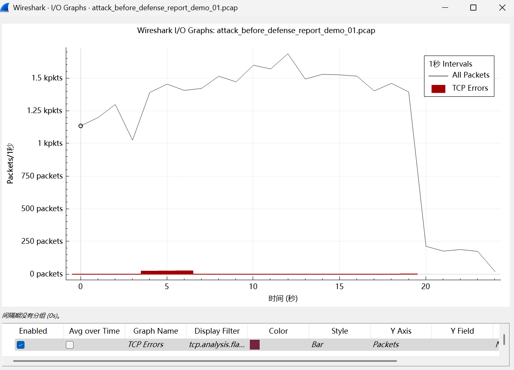

**图 9：** Wireshark I/O · 防御后（稳态 ~130 pps）

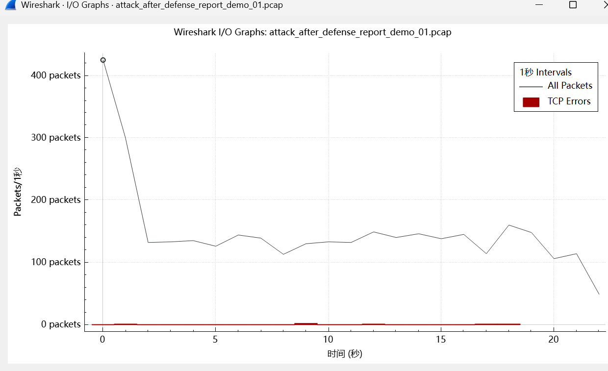

### 5.8 可视化仪表盘

数据来源：`scripts/visualize_demo.py` 生成，`report/data/logs/report_demo_01/`

| 指标 | 正常 | 防御前 | 防御后 |
| ---- | ---- | ------ | ------ |
| 峰值 PPS | 60 | 1475 | 411 |
| 包数 | 588 | 29,300 | 3,450 |

**图 11：** 普通演示可视化仪表盘（阶段对比 + 流量时间线）

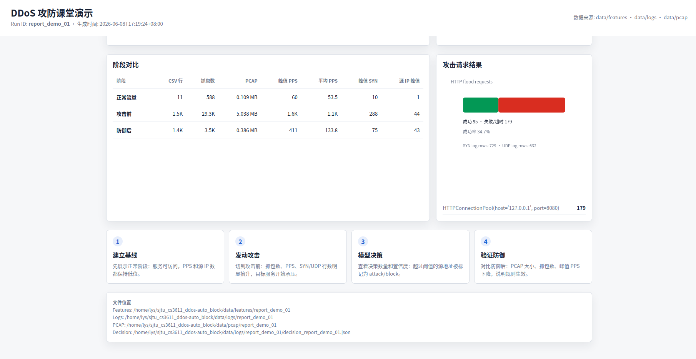

---

## 6. CPU / 内存负载变化

### 6.1 测试方法

- 工具：`htop`
- 时机：防御前、防御后 HTTP Flood 进行中
- 观察项：双核 CPU 使用率、内存占用、`python3 attacks` / `python3 -m http` 进程

### 6.2 测试结果

| 指标 | 防御前（图 2） | 防御后（图 3） | 变化说明 |
| ---- | ------------ | ------------ | -------- |
| CPU 0 | 62.2% | 33.8% | 防御后单核占用下降 |
| CPU 1 | 81.8% | 35.7% | 防御后双核负载均降低 |
| 内存 (Mem) | 1.01 GB / 3.78 GB | 1.01 GB / 3.78 GB | 变化不明显 |
| 主要进程 | `python3 attacks` 最高约 86.5% CPU | 多个 `python3 attacks` 合计负载较低 | 限速后攻击强度被削弱 |

### 6.3 结论

两次混合攻击进行中，`htop` 均出现 CPU 占用。防御前（图 2）双核约 62%～82%，攻击进程峰值约 86.5%；开启完整智能防御后（图 3）同参攻击下 CPU 降至约 34%～36%，与 §5 PPS 下降一致，说明限速后攻击对系统压力减小。内存两次均约 **1.01 GB**，变化不显著。

### 6.4 截图

**图 2：** htop · 防御前（CPU 0/1 ≈ 62%/82%，attacks ≈ 86.5%）

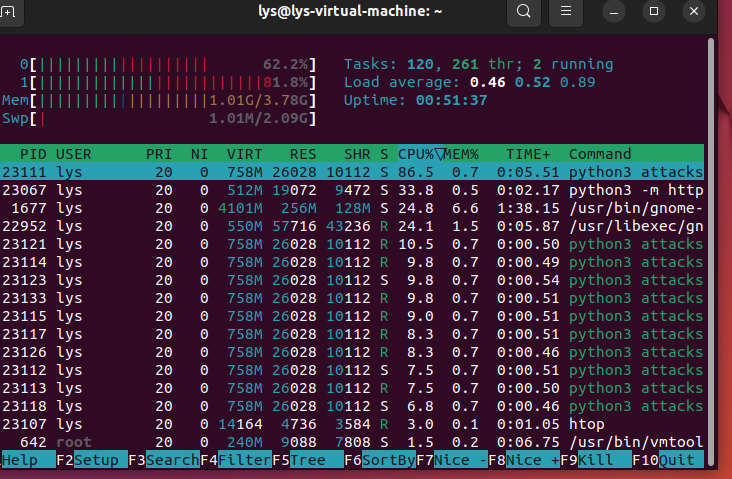

**图 3：** htop · 防御后（CPU 0/1 ≈ 34%/36%）

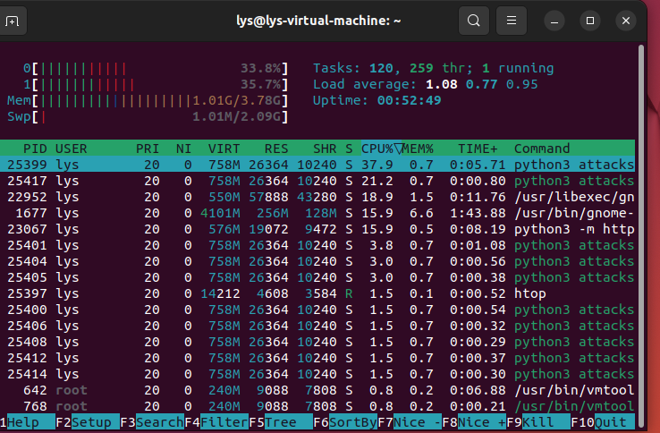

---

## 7. 端到端 Demo 测试

### 7.1 合同自检

| 检查项 | 命令 | 结果 |
| ------ | ---- | ---- |
| 攻击组 | `bash scripts/check_group_contract.sh attack` | 完成 |
| 防御组 | `bash scripts/check_group_contract.sh defense` | 完成 |
| 模型组 | `bash scripts/check_group_contract.sh model` | 完成 |
| 整合预检 | `bash scripts/run_demo.sh --check-only` | 完成 |

**图 1：** 三组 contract passed

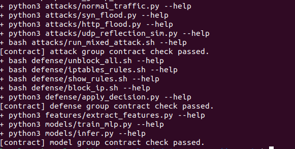

### 7.2 演示阶段

| 阶段 | 内容 | 产出 |
| ---- | ---- | ---- |
| A | 正常流量 10s + 抓包 | `normal_*` |
| B | 混合攻击 20s + 抓包 | `attack_before_defense_*` |
| — | 特征提取 + 推理 + 防御 | `decision_*.json` |
| C | 同参混合攻击 + 抓包 | `attack_after_defense_*` |

---

## 8. 防御执行结果

| 机制 | 说明 |
| ---- | ---- |
| 基础限速 | CS3611_DDOS 链：SYN≤50/s，HTTP≤120/s |
| 模型驱动处置 | 1470 条 block（127.x 源 IP `rate_limit_loopback`） |
| 黑名单链 | CS3611_DDOS_BL 已安装 |
| 非 loopback 演示 | `block_ip.sh --ip 10.0.0.99` 可写入 DROP 规则 |

---

## 9. 实时混合攻击与 AI 联动（Run `realtime_demo_01`）

### 9.1 测试定义

- **脚本：** `scripts/run_realtime_demo.sh`
- **流程：** 前台 `run_mixed_attack.sh` 持续 120s；后台每 4s 执行抓包 → 特征 → 推理 → `apply_decision`
- **与普通过程区别：** 封禁发生在攻击进行中，而非攻击结束后离线推理

### 9.2 实时窗口执行结果

**文件：** `report/data/logs/realtime_demo_01/realtime_window_summary_realtime_demo_01.csv`

| 窗口 | 抓包时长 | extract | infer | apply |
| ---- | ------ | ------- | ----- | ----- |
| 001 | 4s | ok | ok | ok |
| 002 | 4s | ok | ok | ok |
| 003 | 4s | ok | ok | ok |

3 个窗口均完成「抓包 → 推理 → 封禁」全链路。

### 9.3 实时决策与流量效果

| 指标 | 数值 |
| ---- | ---- |
| 模式 | realtime |
| 窗口决策总数 | 616 |
| 最高置信度 | 1.000 |
| 首封延迟 | 约 46 s |
| 攻防峰值 | 2.0K PPS |

**图 10：** 实时攻防演示仪表盘

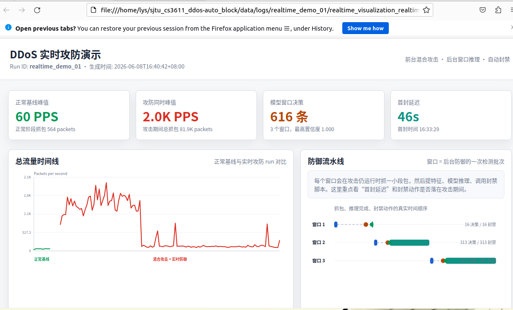

**图 13：** 实时窗口 summary CSV

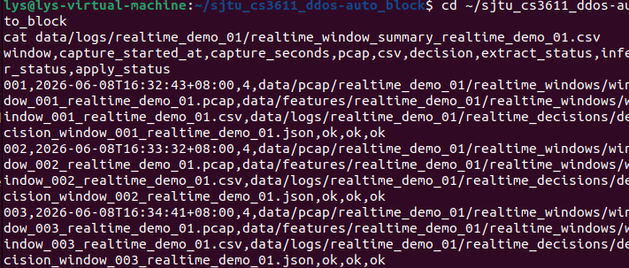

### 9.4 结论

系统在混合攻击持续进行期间，能够按时间窗口完成在线特征提取、MLP 推理与 iptables 自动封禁。

---

## 10. Redis 结构化存储验证

### 10.1 测试条件

- `STORAGE_BACKEND=redis`
- `REDIS_URL=redis://127.0.0.1:6379/0`
- `STORAGE_KEY_PREFIX=cs3611:ddos`

### 10.2 验证结果

```bash
redis-cli SMEMBERS cs3611:ddos:runs
redis-cli HGETALL cs3611:ddos:run:realtime_demo_01
redis-cli XRANGE cs3611:ddos:run:realtime_demo_01:defense_actions - + COUNT 5
```

`defense_block_log rows=616`，与 §9.3 实时窗口决策数一致。

**图 14：** Redis runs 与 run 元信息

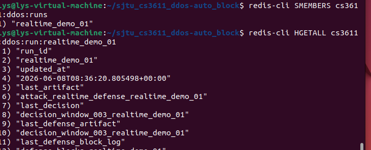

**图 15：** Redis defense_actions 流

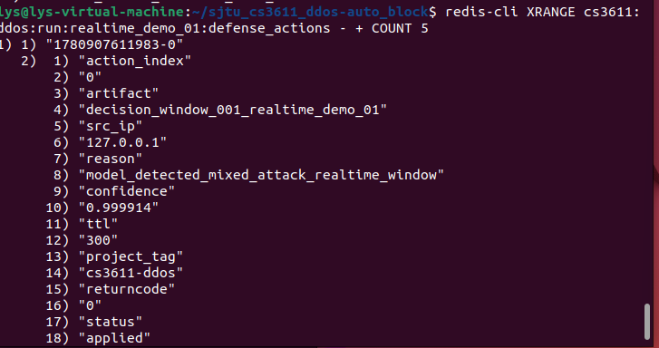

---

## 11. 扩展功能验证

已实现 4 项扩展 ：

| 扩展项 | 验证依据 |
| ------ | -------- |
| **智能攻击分类器** | §5.3 特征 CSV + §5.5 `decision.json`（1470 条，均值 0.985）+ 图 11；`features/extract_features.py`、`models/infer.py` |
| **无监督异常检测** | 代码 `models/anomaly_kmeans.py`、`models/anomaly_autoencoder.py`；`sota_report.json` 融合 F1≈0.9997；单元测试 `models/tests/test_anomaly_detection.py` |
| **自动化防御机制** | §8 规则摘要 + `defense_blocks.log`；防御效果 图 4～9（包数 29300→3450，峰值 PPS 1475→411） |
| **CDN 集成** | 配置文件 `defense/nginx.conf`（8081 反代 8080、`limit_req_zone`、`proxy_cache_path`）；设计见 `report/设计文档.md` §7.5 |


---


